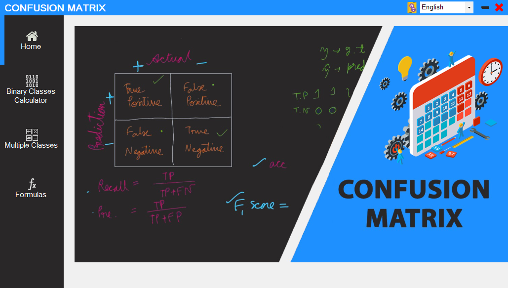
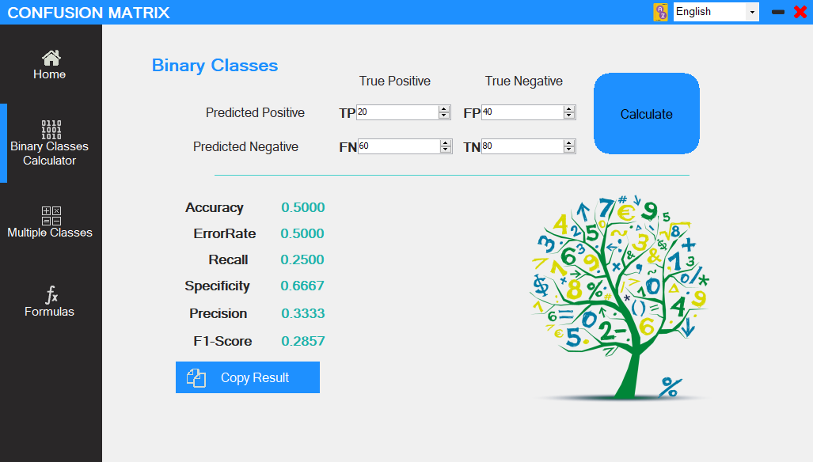
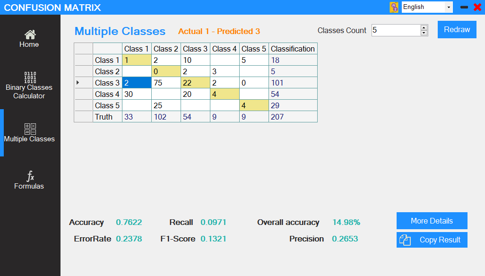
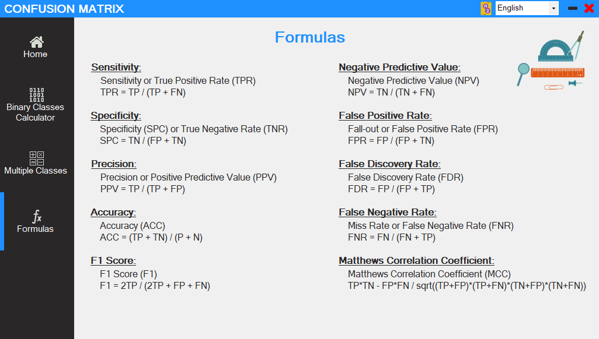

# Confusion-Matrix Calculator

## Overview

The Confusion-Matrix Calculator is a comprehensive tool designed to help users calculate and analyze various performance metrics for classification models. This Windows Forms application, enhanced with the Bunifu UI library, offers a beautiful and intuitive UI/UX. It supports both binary and multi-class classification scenarios and provides multilingual support for a global user base.

## Features

### General Features
- **Beautiful UI/UX**: Built with Windows Forms and the Bunifu UI library for a modern, responsive design.
- **Multilingual Support**: A language select box allows users to localize the entire application to their preferred language.

  

### Binary Class Calculator
- **Input Fields**: Users enter values for True Positives (TP), False Positives (FP), False Negatives (FN), and True Negatives (TN).
- **Calculated Metrics**: The application computes Accuracy, Error Rate, Recall, Specificity, Precision, and F1 Score.
- **Copy Results**: A convenient button lets users copy all calculated results with a single click.

  

### Multi-Class Calculator
- **Dynamic Table**: Users specify the number of classes, and the application generates an empty table for input.
- **Real-time Calculations**: As users fill in the table, the app calculates Accuracy, Error Rate, Recall, Specificity, Precision, and F1 Score for the multi-class scenario.
- **Detailed Analysis**: A "More Details" button shows a modal with a detailed breakdown of metrics for each class individually.

  

### Formulas Page
- **Educational Resource**: Contains all the necessary formulas for manual calculations of the performance metrics.
- **Localized Content**: Formulas and explanations are available in multiple languages as selected by the user.

  

## Usage

### Binary Class Calculator
1. **Enter Values**: Fill in the values for TP, FP, FN, and TN.
2. **Calculate**: The app will automatically compute the metrics.
3. **Copy Results**: Use the copy button to easily transfer results.

### Multi-Class Calculator
1. **Specify Classes**: Enter the desired number of classes.
2. **Fill Table**: Input the class values into the generated table.
3. **View Metrics**: See the real-time calculations of performance metrics.
4. **Detailed View**: Click "More Details" for an in-depth analysis of each class.

### Formulas Page
- **Reference**: Access the page to view and study the formulas used for calculating the metrics, with content available in multiple languages.

## Conclusion
The Confusion-Matrix Calculator is an essential tool for students, data scientists, and machine learning practitioners who need to evaluate classification models. Its user-friendly design, real-time calculations, and detailed metric analysis make it a valuable resource for both educational and professional purposes.
